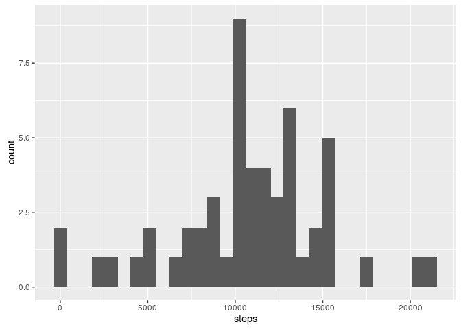
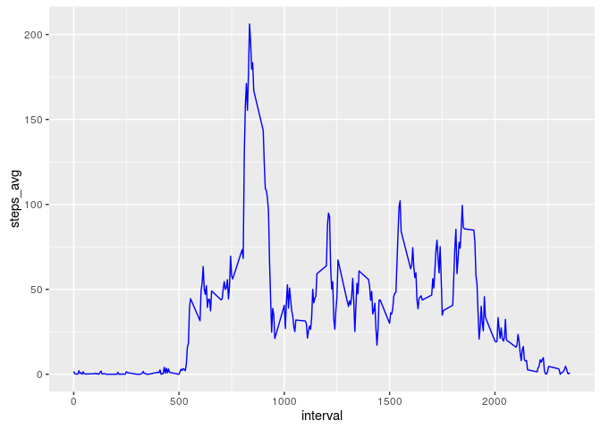
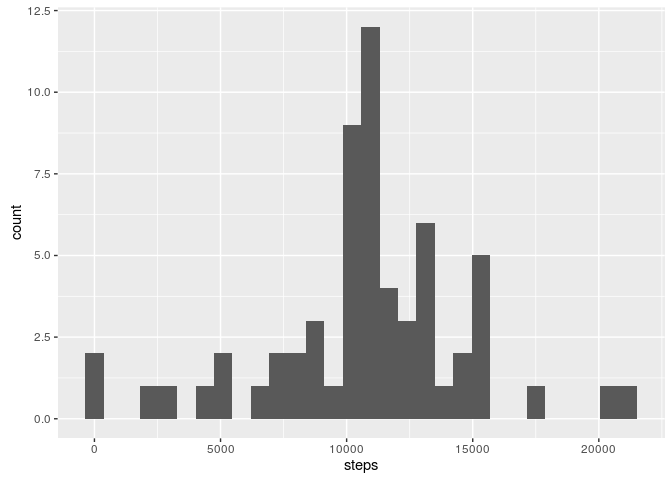
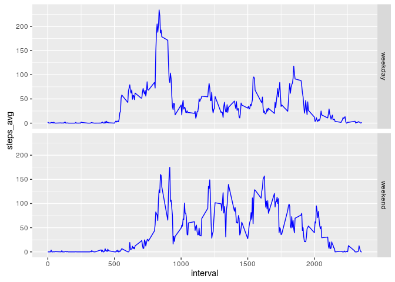

# Reproducible Research: Peer Assessment 1
Wagner Pinheiro  
January, 2017  

## Introduction

It is now possible to collect a large amount of data about personal
movement using activity monitoring devices such as a
[Fitbit](http://www.fitbit.com), [Nike
Fuelband](http://www.nike.com/us/en_us/c/nikeplus-fuelband), or
[Jawbone Up](https://jawbone.com/up). These type of devices are part of
the "quantified self" movement -- a group of enthusiasts who take
measurements about themselves regularly to improve their health, to
find patterns in their behavior, or because they are tech geeks. But
these data remain under-utilized both because the raw data are hard to
obtain and there is a lack of statistical methods and software for
processing and interpreting the data.

This assignment makes use of data from a personal activity monitoring
device. This device collects data at 5 minute intervals through out the
day. The data consists of two months of data from an anonymous
individual collected during the months of October and November, 2012
and include the number of steps taken in 5 minute intervals each day.


```r
# load libraries
suppressPackageStartupMessages(library(ggplot2))
suppressPackageStartupMessages(library(dplyr))
```


## Loading and preprocessing the data


```r
activity_csv <- read.csv("activity.csv")
activity_csv$date = as.Date(activity_csv$date)
activity <- activity_csv[complete.cases(activity_csv),]
str(activity)
```

```
## 'data.frame':	15264 obs. of  3 variables:
##  $ steps   : int  0 0 0 0 0 0 0 0 0 0 ...
##  $ date    : Date, format: "2012-10-02" "2012-10-02" ...
##  $ interval: int  0 5 10 15 20 25 30 35 40 45 ...
```


## What is mean total number of steps taken per day

1. histogram of the total number of steps taken each day


```r
total_activity_per_day <- activity %>%
  group_by(date) %>%
  summarise(steps = sum(steps))

ggplot(total_activity_per_day, aes(x=steps)) +
  geom_histogram()
```

```
## `stat_bin()` using `bins = 30`. Pick better value with `binwidth`.
```

<!-- -->

2. The **mean** and **median** of the total number of steps taken per day


```r
mean(total_activity_per_day$steps)
```

```
## [1] 10766.19
```


```r
median(total_activity_per_day$steps)
```

```
## [1] 10765
```


## What is the average daily activity pattern?

1. Time series plot of the 5-minute interval (x-axis) and the average number of steps taken, averaged across all days (y-axis)


```r
mean_activity_per_day <- activity %>%
  group_by(interval) %>%
  summarise(steps_avg = mean(steps))

ggplot(data=mean_activity_per_day, aes(x=interval, y=steps_avg)) +
    geom_line(colour = "blue")
```

<!-- -->

2. maximum number of steps on 5 minute interval

```r
mean_activity_per_day[mean_activity_per_day$steps_avg == max(mean_activity_per_day$steps_avg), ]
```

```
## # A tibble: 1 × 2
##   interval steps_avg
##      <int>     <dbl>
## 1      835  206.1698
```


## Imputing missing values

1. total number of missing values in the dataset (i.e. the total number of rows with `NA`s)


```r
table(is.na(activity_csv$steps))
```

```
## 
## FALSE  TRUE 
## 15264  2304
```


```r
table(is.na(activity_csv$date))
```

```
## 
## FALSE 
## 17568
```


```r
table(is.na(activity_csv$interval))
```

```
## 
## FALSE 
## 17568
```

2-3. filling in all of the missing values in the dataset with the mean of 5 min interval


```r
fillValue <- function(steps, interval) {
    filled <- NA
    if (!is.na(steps)) 
        filled <- c(steps) else filled <- (mean_activity_per_day[mean_activity_per_day$interval == interval, "steps_avg"])
    return(filled)
}

filled_activity <- activity_csv
filled_activity$steps <- mapply(fillValue, filled_activity$steps, filled_activity$interval)
filled_activity$steps <- as.integer(filled_activity$steps)

table(is.na(filled_activity))
```

```
## 
## FALSE 
## 52704
```


4. histogram of the total number of steps taken each day with filled data


```r
total_filled_activity <- filled_activity %>%
  group_by(date) %>%
  summarise(steps = sum(steps))

ggplot(total_filled_activity, aes(x=steps)) +
  geom_histogram()
```

```
## `stat_bin()` using `bins = 30`. Pick better value with `binwidth`.
```

<!-- -->


```r
mean(total_filled_activity$steps)
```

```
## [1] 10749.77
```


```r
median(total_filled_activity$steps)
```

```
## [1] 10641
```

Mean and median values are higher after imputing missing data. The reason is that in the original data, there are some days with steps values NA for any interval. The total number of steps taken in such days are set to 0s by default. However, after replacing missing steps values with the mean steps of associated interval value, these 0 values are removed from the histogram of total number of steps taken each day.

## Are there differences in activity patterns between weekdays and weekends?

1. Creating a new factor variable in the dataset with two levels -- "weekday" and "weekend" indicating whether a given date is a weekday or weekend day.


```r
activity$weekday <- weekdays(activity$date)
activity$weekday <- as.factor(activity$weekday)
levels(activity$weekday)
```

```
## [1] "domingo" "quarta"  "quinta"  "sábado"  "segunda" "sexta"   "terça"
```

```r
activity$is_weekday <- "weekday"
activity$is_weekday[activity$weekday %in% c("sábado", "domingo")] <- "weekend"
activity$is_weekday <- as.factor(activity$is_weekday)
str(activity)
```

```
## 'data.frame':	15264 obs. of  5 variables:
##  $ steps     : int  0 0 0 0 0 0 0 0 0 0 ...
##  $ date      : Date, format: "2012-10-02" "2012-10-02" ...
##  $ interval  : int  0 5 10 15 20 25 30 35 40 45 ...
##  $ weekday   : Factor w/ 7 levels "domingo","quarta",..: 7 7 7 7 7 7 7 7 7 7 ...
##  $ is_weekday: Factor w/ 2 levels "weekday","weekend": 1 1 1 1 1 1 1 1 1 1 ...
```


2. time series plot of the 5-minute interval (x-axis) and the average number of steps taken, averaged across all weekday days or weekend days (y-axis)


```r
mean_activity_per_weekday <- activity %>%
  group_by(interval, is_weekday) %>%
  summarise(steps_avg = mean(steps))

ggplot(data=mean_activity_per_weekday, aes(x=interval, y=steps_avg)) +
  geom_line(colour = "blue") +
  facet_grid(is_weekday ~ .)
```

<!-- -->
